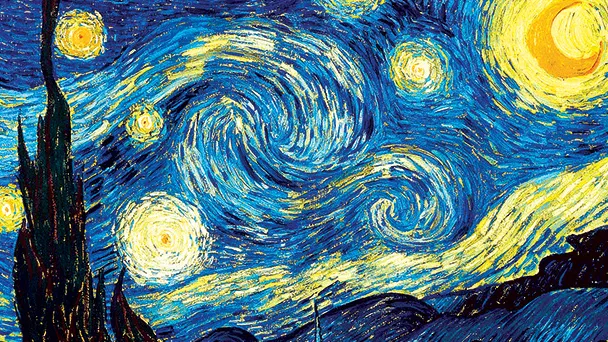

# Animación de "La Noche Estrellada" de Vincent Van Gogh


## Descripción

Este repositorio contiene un programa en Python que genera una animación que construye la famosa pintura "La Noche Estrellada" de Vincent Van Gogh, siguiendo un guion específico de animación.

## Guion de la Animación

- **Primeros 3 segundos**: La luna aparece gradualmente en toda la escena.
- **Desde el segundo 3**: Se hace un zoom out hacia el resto de la pintura, manteniendo el aspect ratio.
- **Aparición de astros**: Cada astro aparece con un efecto de fade in desde el centro hasta el tamaño final, tomando 3 segundos para completarse.
- **Espiral central**: La espiral del centro realiza un efecto de destello sobre el fondo, una vez que la pintura completa está en escena.

El programa utiliza estructuras de árboles para la construcción de escenas, donde cada nodo representa un elemento de la escena con su animación correspondiente. El programa genera imágenes (frames) que luego se renderizan para crear el video de animación.

## Características

- **Generación de Frames**: Creación de múltiples frames que representan la animación de los elementos de la pintura.
- **Renderización**: Los frames se combinan para producir un video animado.
- **Uso de Librerías de Python**: Se utilizan diversas librerías para la generación y manipulación de imágenes y videos.


## Requisitos

- Python 3.x
- Librerías de Python: cv2, numpy, random y os

## Instalación y ejecución

1. Clona este repositorio:
   ```bash
   git clone https://github.com/MeredithMoreno/Animacion_NocheEstrellada_Python.git
2. Dirígete al directorio del repositorio clonado:
    ```bash
    cd Animacion_Noche_Estrellada_Python
3. Instala las dependencias:
    ```bash
    pip install -r requirements.txt
4. Ejecuta el script app.py para generar la animación:
    ```bash
    python App.py
5. **¡DISFRUTA DE LA ANIMACIÓN!**
